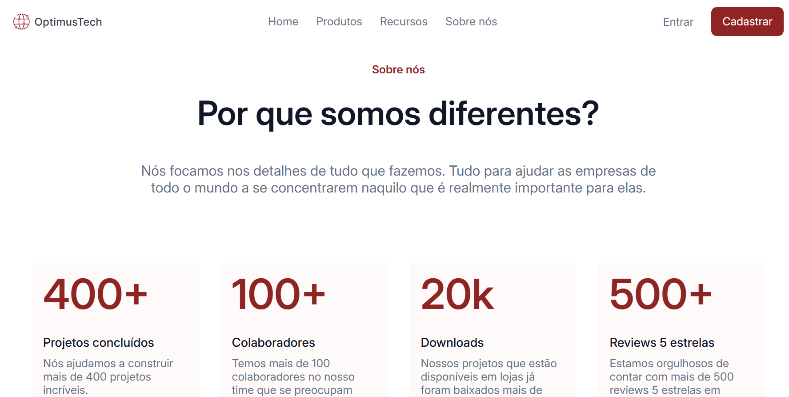

# OptimusTech

Este layout é de uma empresa de tecnologia que quer realizar novas contratações. O projeto foi desenvolvido como parte do desafio 7 Days of Code da Alura, com foco em HTML e CSS, priorizando a criação de um layout estático.
O design visual foi realizado através do layout do Figma: https://www.figma.com/design/mm3MLozvUDGhDRTxSLlGL5/7daysOfCode-HTML-CSS?node-id=0-1&node-type=canvas&t=jfWMof7o3ADqbNPs-0

**✅ Objetivo:**

Criar um layout visualmente atraente para a página da OptimusTech.
Destacar os principais diferenciais da empresa, como número de projetos, colaboradores, downloads e avaliações.
Apresentar um design clean e profissional, alinhado com a identidade visual da empresa.

**💻 Tecnologias Utilizadas:**

HTML5: Estruturação da página e conteúdo.
CSS3: Estilização visual, layout e responsividade.

## Resultado Final
[Clique aqui para ver o resultado.](https://optimus-tech-chi-fawn.vercel.app/)

**📩 Contato**
Para dúvidas ou sugestões, entre em contato: raissa.mnascimento26@gmail.com
